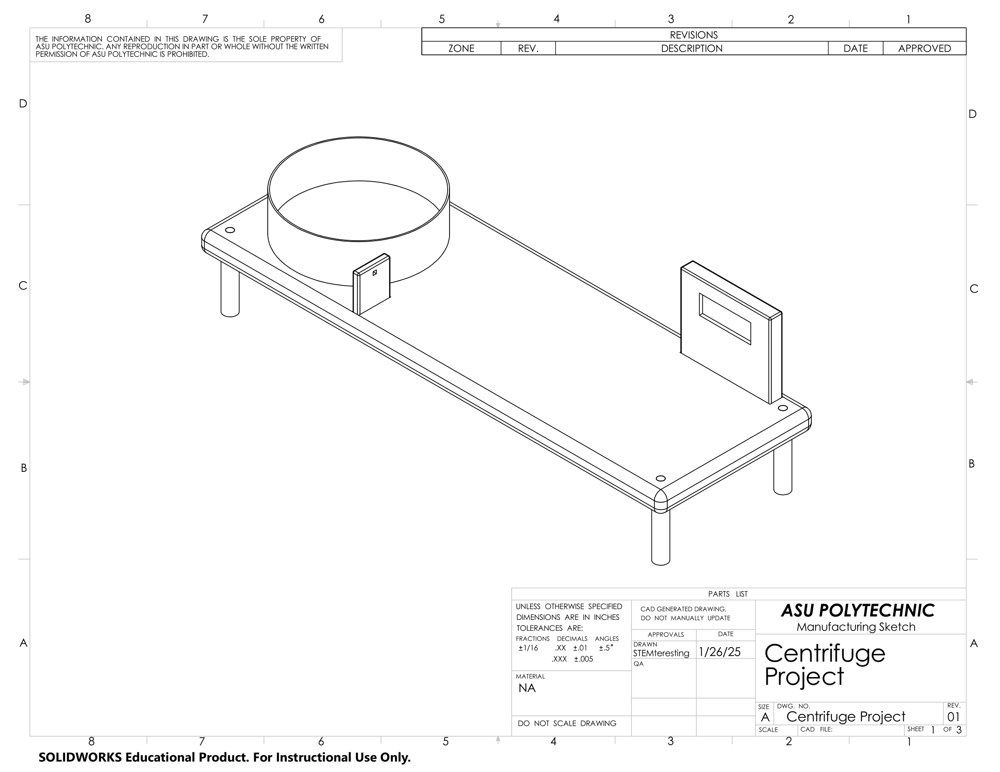
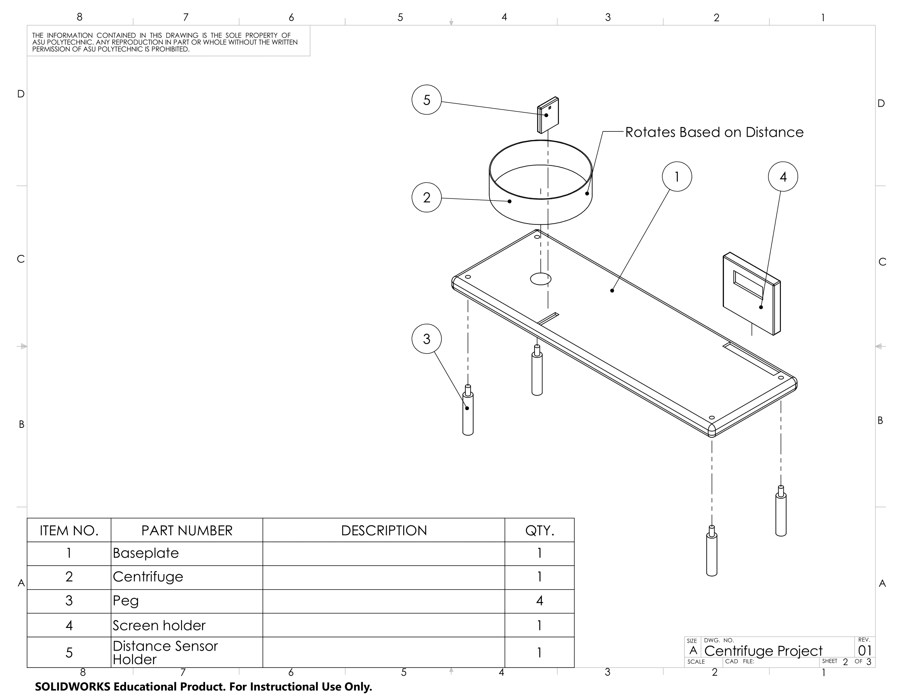

# Our Exhibit
The goal of our exhibit is to let people learn concepts through a demonstration of some type of STEM topic. We have determined that these topics must be related to something that these people have already been exposed to or will be. For example an exhibit of induction to children would be out of place but an exhibit of the color spectrum would be appropriate. The exhibit should also be interactive so that learning the concept or topic would be made easier. We don't want to make something that will just be stared at by an audience. We feel that having a user change variables will insure a higher change of a person learning the topic or concept displayed. 

Our audience will be 4th to 8th graders, as students in this age range are old enough to be trusted around more devices than children under this age range. Categorizing these students by grade also allows the team to understand what topics are appropriate for the age. The state of Arizona has standards for these grade levels, which can help inform what topics will be too advanced or too juvenile for our audience. 
## Preliminary research
In the article, “[Ideation in Practice: How Effective UX Teams Generate Ideas](https://www.nngroup.com/articles/ideation-in-practice/)”, one of the things that can be challenging during the ideation process is a lack of user research. This is usually due to a lack of time for the ideation process. While our team did experience a time crunch during the ideation process, research was still done to give ourselves a basis for generating ideas.

Our team did preliminary research before generating ideas for 4th-8th graders. To do this, we found it necessary to research what children were learning in the STEM field. Each STEM field has its subcategories. In the science field, there is life science, physical science, and space/earth science. We found these subcategories and then sorted them into a table. Then for each of these subcategories we found topics relating to them. We made sure that these topics are plausible for 4th-8th graders to learn and that they have some concept of it before viewing/interacting with the project. From these topics we were able to then create ideas for a project. These topics can be seen in Table 1.  

### Table 1 Topics for 4th-8th Graders

From these topics we then generated several ideas that we could make an exhibit around. After generating these ideas, we then label if they were actuator, human interface, sensor and/or topic idea. Below is the list of ideas we made in a doc.

### List of Ideas

1. Recycling
2. Show how sample size effects data
3. Types of plastics (sorting game where you match the bottle to the type based on the number)
4. What happens when materials go in the microwave (safety)
5. Gear ratios
6. Sorting game
7. WiFi enabled waiting list
Parts of flowers
Pollinators
Motion sensor
Distance sensor
Pressure sensor
Seismograph
Impulse
Bell ringing arcade game
Leverage (move the base of a seesaw and show how much easier it is t lift things with the long end)
Water cycle (sort the stages)
Energy generation (kid spins motor, power output measured, powers a speaker that plays something selected over the internet)
Eddy Currents (motor drops magnet in tube, distance sensor at bottom, show fall speed with an OLED screen)
OLED Screen showing sensor data
Use motor to drop something
Ice melt experiment (moisture sensor on plate, cup full of ice and water, detect spillover and announce with speaker)
Thermometer
Show muscle contraction and relaxation 
Pressure sensor to activate the demo
Motorized pulley 
Model of extruder
Motor spinning an auger
Astronomy (How many earths fit in the sun)
the kid pours how many earth can fit in the sun into a model sun
weight the model and calculate number of earths
announce the number on a speaker
Camera for color sensing through matlab
Camera for centering
Diodes (show how direction affects the width of the two regions)
Kid puts model diode in modle circuit forward of backwards
Motor moves model to reflect internal motion of the diode
Interactive Plant Cell
Screen for images and picture
Logic gate interactive
Changing states via internet
Light prism mixing
Rotating motor based of human input
Light sensor
Color sensor
Basic LED Circuit
Voltmeter sensor
Ampmeter sensor
Pulley Demonstration
Equivalent Planet Gravity
Centrifuge type actuator
Rotating Rock Plate
Floating Styrofoam
Speakers to make standing wave
Sound sensor
Precipitation Demonstration
Moisture sensor
Liquid, Solid, Gas H20 demonstration
Interactive Survey of Questions
Real time changing statistics
Wind generator
Solar generator
Motor
Power a wind turbine with a modular fan
Curdle milk with lemon juice (chemical reaction)
Rotationally accurate modle solar system (Powered with motor that sppeds up with touch sensor and everything moves at the correct rate with gears)
Touch slider
Tesla Coil
Drive spark gap open and closed with a motor
Centrifuge to separate liquid mixtures (i.e. milk, impure water, koolaid, etc)
Pressure sensor on hammer to show how hard something is being hit
Types of teeth
Turn a telescope and display a different constilation based off of where it is pointing
Build a tower above a certain line
Green screen
Heat sensor
Thermal camera
Boyancy (kid makes a paper boat and puts it on water, marbles are added, sensor tells when boat sinks, speaker plays a "womp womp womp" noise to indicate the boat sunk)
Generate and store electric charge
Hydroelectric generator
Run-of- the-River generator model
Windmill
Light Wavelength Imaging
Moon Mirror and Laser Experiment
Round Earth Experiment
Line following robot
Relative speed experiment: kids are asked whether a projectile will move faster if launched with some velocity in initial conditions. Sensors determine results.
Feather and bowling ball experiment
Signature tracking projectile (But make it cute? Like a heat seeking stuffed animal?)
Googles that use machine learning to identify objects
Steam engine
Robot with markers for legs that paints drawings for the kids
Remote controlled underwater robot that takes footage we could send to parents
3d printed or popsicle stick drone kids the kids can easily assemble during the showcase
“Build a bristle bot” make hex bugs out of toothbrushes and a battery and tiny motor to make it wiggle
Vibration Motor
Light tracker
Search and rescue robot
“Build a bot” kids pick from simple materials, (paper clips etc) to build their own wiggle bot
Moon phases tracking device
Moon phase demo (shine light on ball and show how light curves around the model of the moon)
Live “Distance to the Moon” tracker

## Design Concept Sketch
Our team has decided to demonstrate that gravity can be mimicked using a centrifuge in an interactive science exhibit geared towards fourth to eighth grade students. Even though this is not explicitly a standard topic for the grade level, exposing a student to this concept could ignite their curiosity and make them more interested in related topics in the future. The exhibit will feature a centrifuge that is driven by a motor. The speed of the motor depends on what planet the student selects. The student selects the planet by placing their hands on a mat that shows the planets. A distance sensor will measure how far away their hand is. This data will be communicated with the motor and an OLED screen through the micro controllers. The OLED screen will print out the name of the planet the student has selected. The name of the planet will be sent to the user’s phone through internet communication. If the user presses a button, the OLED screen will display a fact about the current planet. The student using the machine will be given a small piece of clay that they can shape. Once it is their turn to use the machine, their clay is placed on the edge of the machine. When they select their gravity, the machine will spin, squishing their clay figure. The student will get to keep their clay figure once the demonstration is over. A concept design can be seen in Fig.1 and an exploded view in Fig.2 with labeled parts.

### Fig.1 Centrifuge Concept

### Fig.2 Exploded View of Centrifuge Concept

Users will be provided with written instructions and illustrations to guide them through how to interact with the exhibit. These will be printed on the exhibit near the feature that they pertain to in order to ensure that the user sees the instructions and understands how to safely operate the machine. There will be a warning about the centrifuge spinning at high speeds to keep the user from behaving dangerously around the machine. Where appropriate, team members will guide the audience through the demonstration prompts. Users will be asked to “choose their planet” to model their selected acceleration value. Users will identify their planet of choice in the marked location relative to their chosen planet’s distance from the sun. The use of a distance sensor ensures users are a safe distance from rotating components to initiate simulation by requiring that at least one of their hands be significantly far from the centrifuge.
The speed will be controlled by the distance sensor. The student will place one of their hands on a print-out that depicts a selection of planets. The user will place their hand on one of the planets. The distance sensor will read how far away the hand is and cause the motor to spin at the appropriate RPM for the selection. The HMI requirement asks us to allow users to see the sensor data and edit the setpoints for the demo. This would not be a feature that a fourth to eighth grader should have access to, as they could set certain values to dangerously high or low numbers and it is not necessary for the demonstration. This feature would only be used by demonstrators (i.e. teachers, developers, and museum employees) in case they want to change any of the values or diagnose potential issues with the device. 
The demo will have the following safety features to ensure that no one gets hurt while interacting with the machine. The centrifuge will be securely mounted and any contents will be sealed in the centrifuge while it is on. This is to ensure that nothing flies out of the machine, potentially injuring people. Users will have to keep at least one hand far away from the machine in order to use the controls. If no hand is present, the machine will not spin. Students and users with long hair will be instructed that their hair must be tied up and secured to keep it from getting caught in the machine. Users will be instructed and warned to not stand too close to the centrifuge. 
This exhibit can be split up into four subsystems. All of these subsystems would have some type of microcontroller and these controllers would communicate to each other via serial communication. The first subsystem would be a motor connected to an IC. The second subsystem would be the digital distance sensor that uses serial communion. Another would be a human interface for de-bugging. It will also be used for displaying information to the 4th-8th grader. Lastly, there would be a subsystem that sends information via the internet to a user and they could also send information back to the microcontroller. These subsystems would be split up among each member of STEMtresting. 
